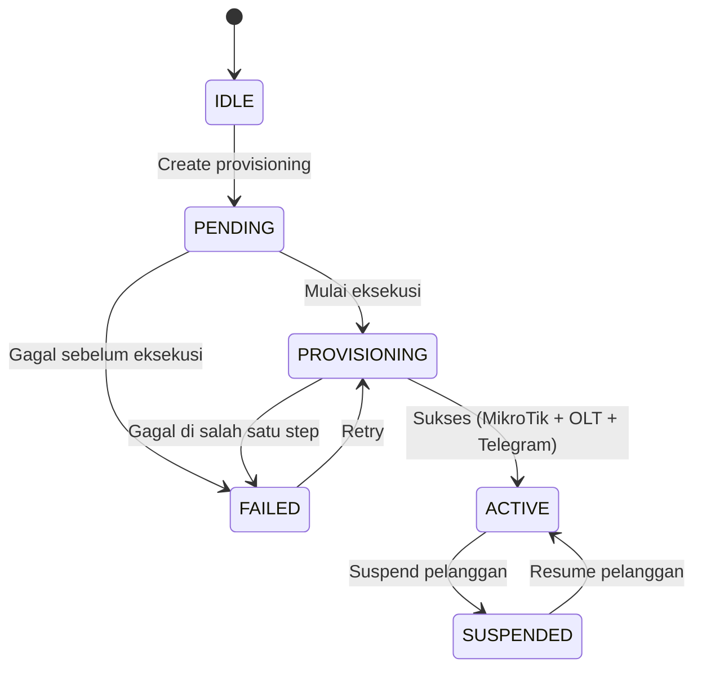
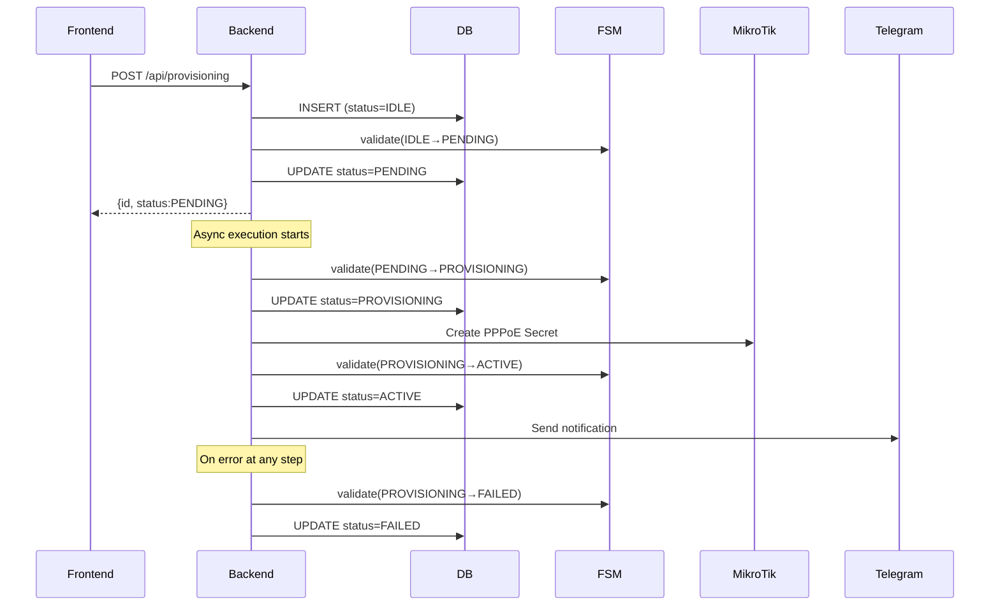

# Finite State Machine (FSM) — FTTH Provisioning

## Overview

FSM digunakan untuk mengelola lifecycle dari provisioning pelanggan FTTH. Setiap record provisioning berada dalam satu state, dan hanya bisa bertransisi ke state tertentu yang telah didefinisikan.

## State Diagram



## States

| State | Deskripsi |
|---|---|
| `IDLE` | Record baru, belum diproses |
| `PENDING` | Menunggu dieksekusi (baru dibuat) |
| `PROVISIONING` | Sedang diproses (MikroTik / OLT / Telegram) |
| `ACTIVE` | Berhasil, layanan aktif |
| `SUSPENDED` | Ditangguhkan sementara |
| `FAILED` | Gagal, bisa di-retry |

## Transition Rules

```javascript
TRANSITIONS = {
  IDLE:          ["PENDING"],
  PENDING:       ["PROVISIONING", "FAILED"],
  PROVISIONING:  ["ACTIVE", "FAILED"],
  ACTIVE:        ["SUSPENDED"],
  SUSPENDED:     ["ACTIVE"],
  FAILED:        ["PROVISIONING"],
};
```

## Validasi Transisi

Setiap perubahan state harus melewati validasi:

```
Input: currentState, newState
Process: Cek apakah newState ada di TRANSITIONS[currentState]
Output: Jika valid → update, Jika invalid → throw error
```

## Implementasi di Kode

### Backend (`constants.js`)
```javascript
const FSM_TRANSITIONS = {
  [FSM_STATES.IDLE]:          [FSM_STATES.PENDING],
  [FSM_STATES.PENDING]:       [FSM_STATES.PROVISIONING, FSM_STATES.FAILED],
  [FSM_STATES.PROVISIONING]:  [FSM_STATES.ACTIVE, FSM_STATES.FAILED],
  [FSM_STATES.ACTIVE]:        [FSM_STATES.SUSPENDED],
  [FSM_STATES.SUSPENDED]:     [FSM_STATES.ACTIVE],
  [FSM_STATES.FAILED]:        [FSM_STATES.PROVISIONING],
};

function validateTransition(currentState, newState) {
  const allowed = FSM_TRANSITIONS[currentState];
  if (!allowed || !allowed.includes(newState)) {
    throw new Error(
      `Invalid FSM transition: ${currentState} → ${newState}. ` +
      `Allowed: ${(allowed || []).join(", ") || "none"}`
    );
  }
}
```

### Alur Eksekusi dengan FSM


